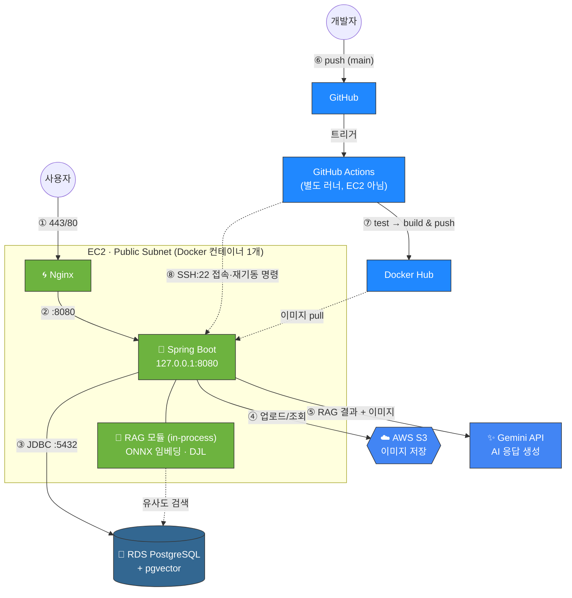

# 🛵 배달 주문 관리 플랫폼 (먹자GO)


> **배달 주문 관리 플랫폼**은 사용자가 가게를 찾아 메뉴를 주문·결제하고, 사장님(Owner)은 가게와 메뉴를 관리하며, RAG 기반 AI가 메뉴 설명까지 자동으로 작성해주는 배달 서비스 백엔드입니다.

---
## 🔗 API

- [**Base URL**](https://meogjago.shop)
- [**Swagger UI**](https://meogjago.shop/swagger-ui/index.html)
---

## 🚀 프로젝트 소개 (Introduction)

단순 CRUD를 넘어, **역할(Role) 기반으로 손님·사장님·매니저·마스터가 각자 다른 권한으로 하나의 플랫폼을 함께 사용**하는 구조입니다.

손님은 가게를 검색해 메뉴를 담아 주문하고, 배달 완료 후 리뷰를 남깁니다. 사장님은 본인 가게·메뉴를 등록/관리하고, 메뉴 사진과 프롬프트만 넣으면 **AI(Gemini)가 카테고리별 RAG 문서를 참고해 메뉴 설명을 자동 생성**합니다. 매니저/마스터는 지역·카테고리 마스터 데이터와 전체 데이터를 관리합니다.

### 🎯 주요 목표

* **역할 기반 접근 제어:** 4단계 Role(`CUSTOMER`/`OWNER`/`MANAGER`/`MASTER`)에 따라 메서드 단위로 세밀하게 권한 분리
* **AI 메뉴 설명 자동화:** 벡터DB(pgvector) 기반 RAG 검색 + Gemini 멀티모달(텍스트+이미지) 호출로 사장님의 메뉴 등록 부담 경감
* **안정적인 배포 파이프라인:** GitHub Actions → Docker Hub → EC2로 이어지는 자동 배포, 헬스체크로 배포 실패 조기 감지

---

## 👥 팀원 소개 (Team Members)

<table>
  <tr>
    <th nowrap>담당 영역</th>
    <th nowrap>이름&nbsp;&nbsp;&nbsp;&nbsp;&nbsp;</th>
    <th>주요 작업</th>
  </tr>
  <tr>
    <td nowrap>🔑 인증/유저</td>
    <td nowrap><b>정승호</b>&nbsp;&nbsp;&nbsp;</td>
    <td>Spring Security + JWT 인증/인가, 회원가입·로그인·내 정보 조회/수정·회원 탈퇴</td>
  </tr>
  <tr>
    <td nowrap>🏪 가게/카테고리/지역</td>
    <td nowrap><b>황지호</b>&nbsp;&nbsp;&nbsp;</td>
    <td>가게 CRUD(등록·수정·폐업·검색), 카테고리·지역 CRUD 및 필터링</td>
  </tr>
  <tr>
    <td nowrap>🍔 메뉴 + AI 연동</td>
    <td nowrap><b>김태희</b>&nbsp;&nbsp;&nbsp;</td>
    <td>메뉴 CRUD, 외부 AI API 연동, 메뉴 설명 자동 생성 및 답변 길이 제한</td>
  </tr>
  <tr>
    <td nowrap>🧾 주문/리뷰</td>
    <td nowrap><b>이규민</b>&nbsp;&nbsp;&nbsp;</td>
    <td>주문 생성·취소(5분 제한)·상태 관리, 리뷰</td>
  </tr>
  <tr>
    <td nowrap>💳 결제</td>
    <td nowrap><b>최필규</b>&nbsp;&nbsp;&nbsp;</td>
    <td>가상 결제(Mock PG) 승인/취소, 주문 완료</td>
  </tr>
  <tr>
    <td nowrap>🛠 공통/인프라</td>
    <td nowrap><b>박수빈</b>&nbsp;&nbsp;&nbsp;</td>
    <td>응답구조/예외처리/코드 컨벤션 통일, Swagger, CI/CD, 인프라 설계, 배포</td>
  </tr>
</table>

---

## 🔗 [ERD](https://www.erdcloud.com/d/aTwrnMKbmobj8osHj)


---

## 🛠 기술 스택 (Tech Stack)

### Backend
- **Language:** Java 17
- **Framework:** Spring Boot 3.5.16
- **Database:** PostgreSQL (운영: AWS RDS), pgvector 확장
- **ORM:** Spring Data JPA + QueryDSL 5.1.0
- **Auth:** Spring Security + JWT (jjwt), BCrypt
- **AI:** Spring AI — Google GenAI(Gemini) Chat, Transformers(ONNX) 임베딩, pgvector VectorStore
- **Storage:** AWS S3 (이미지)

### Architecture & Design Pattern
- **RAG in-process 구조:** 별도 AI 서버 없이 임베딩 모델(ONNX/DJL)이 Spring Boot와 같은 JVM/컨테이너 안에서 동작, 벡터는 별도 벡터DB가 아니라 RDS의 pgvector 확장에 저장
- **상태 전이 그래프:** 주문(`Order`)의 상태 변경은 하드코딩된 if/else가 아니라 `OrderStatus.canChangeTo()` 전이 그래프로 검증
- **Soft Delete + 부분 유니크 인덱스:** 논리 삭제 후 재등록/재작성을 허용하기 위해 `WHERE deleted_at IS NULL` 조건의 partial unique index 활용 (리뷰-주문, 가게-지역명)



---

## 🚀 배포 구조

- 백엔드 서버는 `main` 브랜치 push를 기준으로 배포됩니다.
- GitHub Actions 러너에서 테스트 → Spring Boot 애플리케이션을 Docker 이미지(멀티스테이지)로 빌드합니다 *(EC2가 아닌 별도 러너에서 빌드 — EC2의 RAM 1GB·CPU 크레딧 보호 목적)*.
- 빌드된 이미지는 Docker Hub(Public Repo)에 업로드됩니다.
- GitHub Actions가 SSH로 EC2에 접속해 최신 이미지를 pull 받아 컨테이너로 재기동합니다.
- Nginx가 443/80을 받아 `127.0.0.1:8080`으로만 바인딩된 컨테이너에 리버스 프록시합니다 (외부에서 8080 직접 접근 불가).
- 환경 변수·시크릿은 이미지에 포함하지 않고, **컨테이너 실행 시점**에 GitHub Secrets → `-e` 옵션으로만 주입합니다.
- 배포 직후 헬스체크(HTTP 응답 확인, 10회 재시도)로 기동 실패를 자동 감지합니다.

---

## ✨ 핵심 기능 (Key Features)

### 1️⃣ 가게 & 메뉴 관리 (Store & Menu)
* **역할 기반 소유권 검증:** 가게 수정/삭제는 `OWNER` 본인 소유 가게에 한해서만 허용.
* **재등록 허용 소프트 삭제:** 가게명은 DB 유니크 제약이 아니라 서비스 레이어에서 "같은 지역 내 삭제되지 않은 가게"만 검사 — 폐업 후 동일 상호 재등록 가능.
* **메뉴 숨김 vs 삭제 분리:** `MenuStatus.HIDDEN`(숨김)과 소프트 삭제(`deletedAt`)를 서로 다른 개념으로 분리 관리.

### 2️⃣ 주문 & 결제 (Order & Payment)
* **상태 전이 그래프:** `REQUESTED → ACCEPTED → COOKING → DELIVERING → DELIVERED → COMPLETED`, 잘못된 상태 전이는 엔티티 레벨에서 차단.
* **5분 취소 제한:** 주문 생성 후 5분이 지나면 취소 불가 (`CANCELABLE_MINUTES = 5`, 엔티티 비즈니스 메서드에 하드코딩되어 서비스 레이어 우회 불가).
* **가상 결제:** 실제 PG 연동 없이 결제 승인/취소 플로우만 시뮬레이션, `Order`와 1:1 유니크 FK 관계.

### 3️⃣ 리뷰 (Review)
* **작성 조건 검증:** 본인 주문 + 배달 완료(`DELIVERED`) 상태만 리뷰 작성 가능.
* **이중 평점 검증:** `rating`(1~5) 범위를 DB `CHECK` 제약과 애플리케이션 Bean Validation으로 이중 검증.
* **부분 유니크 인덱스로 재작성 허용:** `ux_review_order_active`(`WHERE deleted_at IS NULL`) — 리뷰를 지우면 같은 주문에 재작성 가능.

### 4️⃣ 이미지 업로드 (Image + S3)
* **다형성 첨부 구조:** `refType`(`MENU`/`STORE`/`USER`) + `refId`로 여러 도메인이 공용 이미지 테이블을 사용.
* **교체는 새 행으로:** 이미지 교체 시 UPDATE 대신 새 레코드를 추가하는 방식으로 처리(`updatedAt`은 항상 null).

### 5️⃣ AI 메뉴 설명 생성 (RAG + Gemini)
* **완전 in-process RAG:** 임베딩 모델(ONNX)과 벡터 검색이 별도 서버 없이 Spring Boot 컨테이너 안에서 동작.
* **자동 문서 적재:** 앱 기동 시 `classpath:/rag/*.md`(카테고리별 문서)를 읽어 pgvector에 자동 적재(`VectorInitializer`).
* **멀티모달 단일 호출:** pgvector 유사도 검색 결과(RAG 컨텍스트) + 메뉴 이미지를 함께 Gemini에 전달해 설명 텍스트 생성, `AiHistory`에 이력 저장.

---

## 🔐 인증 · 권한 구조

- **Role 4단계:** `CUSTOMER` / `OWNER` / `MANAGER` / `MASTER`
- **JWT 인증:** HS256 서명, `Authorization: Bearer <token>` 헤더(또는 쿠키)로 전달. 클레임에 `sub`(username), `auth`(role) 포함.
- **메서드 단위 인가:** 경로 기반이 아니라 컨트롤러 메서드마다 `@PreAuthorize`로 권한 세분화.
- **가입 시 역할 셀프 승격:** 회원가입 시 `MASTER_TOKEN`/`MANAGER_TOKEN`/`OWNER_TOKEN` 정적 토큰이 일치하면 해당 역할로 가입(기본값 `CUSTOMER`) — API 인증 토큰이 아니라 **가입 시점 권한 게이트** 용도.
- 세션 미사용 완전 STATELESS, CSRF 비활성화.

---

## 🔧 운영 과정에서 해결한 이슈 (Deployment Notes)

프로젝트를 운영 환경에 배포하면서 발생했던 주요 이슈와 해결 내용을 정리했습니다.

> **Public Docker Hub 사용 시 운영 시크릿 관리**
>
> Docker 이미지를 Public Repository에 저장하므로 운영 시크릿이 이미지에 포함되지 않도록 설계했습니다.  
> GitHub Secrets를 이용해 컨테이너 실행 시점에만 환경변수를 주입하여, 공개 이미지에는 운영 정보가 포함되지 않도록 구성했습니다.

> **Alpine 기반 Docker 이미지 호환성 문제**
>
> RAG 임베딩에 사용하는 DJL 네이티브 라이브러리가 Alpine(musl libc) 환경에서 정상적으로 동작하지 않았습니다.  
> Docker 베이스 이미지를 glibc 기반의 `eclipse-temurin:17-jre-jammy`로 변경하여 호환성 문제를 해결했습니다.

> **소형 EC2 환경 메모리 최적화**
>
> 1GB RAM 환경에서 Spring Boot와 ONNX 임베딩 모델을 함께 실행하면서 메모리 부족(OOM)이 발생했습니다.  
> JVM Heap 크기를 조정하고 Swap을 추가하여 안정적으로 서비스가 기동되도록 개선했습니다.
---

## 📁 프로젝트 구조 (Package Structure)

도메인별로 패키지를 분리해 응집도를 높였습니다. (패키지/네이밍/Entity 규칙 상세는 [`CONTRIBUTING.md`](./CONTRIBUTING.md) 참고)

```text
com.example.delivery
├── global
│   ├── config          # SecurityConfig, JpaAuditingConfig, S3Config, Swagger 등
│   ├── common          # BaseEntity, ApiResponse, PageableFactory, JwtUtil
│   └── exception        # ErrorCode, BusinessException, GlobalExceptionHandler
├── user                 # 회원, 주소, JWT 인증/인가
├── store                # 가게
├── menu                 # 메뉴 + AI(RAG/Gemini) 메뉴 설명 생성, AI 히스토리
├── order                # 주문, 주문상품 (상태 전이 그래프)
├── payment              # 결제 (가상 결제)
├── review               # 리뷰 (부분 유니크 인덱스)
├── image                # 이미지 업로드/조회 (S3, 다형성 첨부)
├── category             # 메뉴 카테고리
└── region               # 지역 (부모-자식 계층 구조)
```

---

## 🏃 Getting Started

### 1. Clone

```bash
git clone https://github.com/SD-Team02/SD-Team02-backend.git
cd SD-Team02-backend
```

### 2. 환경 변수 설정

```bash
cp .env.example .env
```

`.env`에 아래 값을 채웁니다 (로컬 개발이면 더미 값도 무방한 항목이 많습니다):

```env
DB_USERNAME=postgres
DB_PASSWORD=1234                 # docker-compose.yml 기본값과 일치해야 함

JWT_SECRET=                      # 32바이트(256비트) 이상 필수 (openssl rand -base64 32)
MASTER_TOKEN=
MANAGER_TOKEN=
OWNER_TOKEN=

AWS_ACCESS_KEY_ID=
AWS_SECRET_ACCESS_KEY=
AWS_REGION=ap-northeast-2
AWS_S3_BUCKET=

AI_API_KEY=                      # Gemini API 키 (빈 값이면 기동 자체가 실패하니 더미값이라도 채울 것)
```

### 3. 로컬 DB 실행

```bash
docker compose up -d
```

`pgvector/pgvector:pg17` 이미지로 `localhost:5433`에 PostgreSQL(+pgvector)이 뜹니다.

### 4. 애플리케이션 실행

```bash
./gradlew bootRun
```

기동 시 `schema.sql`(부분 유니크 인덱스)이 자동 적용되고, `VectorInitializer`가 RAG 문서를 pgvector에 적재합니다.

### 5. API 문서

```
http://localhost:8080/swagger-ui.html
```

---

## 🧪 테스트

```bash
./gradlew test
```

테스트는 H2(인메모리)를 사용하며, pgvector/ONNX 임베딩/Gemini Chat 등 외부 의존 구성은 제외하고 `TestAiConfig`의 가짜 빈으로 대체합니다.

---

## 📝 참고사항

- `User.userId`만 예외적으로 `Long` auto-increment이고, 그 외 모든 엔티티는 `UUID` PK를 사용합니다.
- 모든 도메인 엔티티는 물리 삭제 대신 `softDelete()`를 통한 논리 삭제를 사용합니다 (단, `AiHistory`는 append-only 이력 테이블).
- 이메일/닉네임은 `(값, is_deleted)` 복합 유니크 제약으로, 탈퇴 후 동일 값 재사용이 가능합니다.
